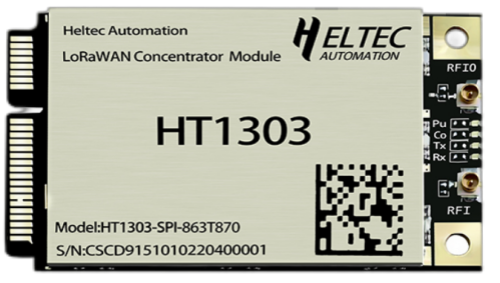

import styles from '@site/src/css/styles.module.css';

  

The HT-1303 LoRaWAN concentrator module is a mini-PCIe-based LPWAN concentrator module based on the Semtech SX1303, which enables easy integration into existing routers or other network equipment equipped with LPWAN Gateway capabilities.

{

  <a href="https://heltec.org/project/ht1303/" className={styles.btnLink1}>
    Product Page
  </a>

}

## Product characteristicss

- SX1303 + SX1250 baseband chipset
- SPI bus
- Mini PCIe socket

## Important Guide

- [Datasheet](https://resource.heltec.cn/download/HT-1303/HT-1303(Rev.1.2).pdf)
- [Usage Guide](/docs/devices/lorawan-application/lora-gateway/ht-1303/qucik_start)
- [HT-1303 LoRa Concentrator Module Linux Driver](/docs/devices/lorawan-application/lora-gateway/ht-1303/ht-1303_lora_concentrator_module_linux_drive)
- [How to Use Heltec 1303 Module on a Windows Computer](/docs/devices/lorawan-application/lora-gateway/ht-1303/how_to_use_heltec_1303_module_on_a_windows_computer)
- [Pin out diagram](https://resource.heltec.cn/download/HT-1303/HT-1303.png)
- [Reference design](https://resource.heltec.cn/download/HT-1303/HT-1303_Reference_Design.pdf)

