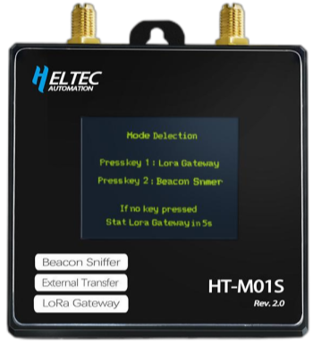

import styles from '@site/src/css/styles.module.css';

  

HT-M01S (Rev. 2.0) is a low-cost indoor LoRa gateway based on the SX1303 + SX1250 structure and powered by an ESP32 main chip, eliminating the need for a separate Linux system. It supports Wi-Fi and Ethernet connections, is powered via Type-C 5V, and features a 1.8-inch TFT display. With basic dust protection and a compact design, it’s ideal for factories, warehouses, and home environments.

{

  <a href="https://heltec.org/project/ht-m01s-v2/" className={styles.btnLink1}>
    Product Page
  </a>

}

## Product characteristicss

-  SX1303 baseband chip
-  LoRaWAN protocol 1.0.2 Class A, Class C support
-  Support Wi-Fi or Ethernet to connect to the network
-  Support Type-C_5V power supply
-  Onboard 1.8-inch TFT display

## Important Guide
- [Datasheet](https://resource.heltec.cn/download/HT-M01S_V2/HT-M01S-V2(V1.1).pdf)
- [Usage Guide](/docs/devices/lorawan-application/lora-gateway/ht-m01s_v2/quick_start)
- [Firmware Upgrade](/docs/devices/lorawan-application/lora-gateway/ht-m01s_v2/update_firmware)

