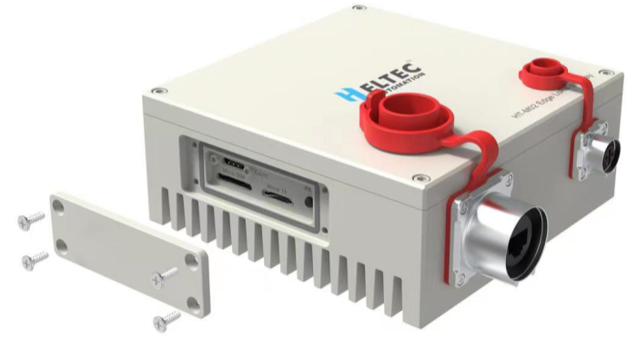

import styles from '@site/src/css/styles.module.css';

  

HT-M02 is an edge computing LoRa gateway with a durable aluminum shell for superior protection and heat dissipation. It offers strong processing power and flexible configuration options, including LTE, PoE, and Wi-Fi, to suit various applications.

{

  <a href="https://heltec.org/project/ht-m02-v2/" className={styles.btnLink1}>
    Product Page
  </a>

}

## Product characteristicss

- Powered by ROCKCHIP Quad-core Cortex-A55 1.8GHz processor with 2GB DDR4 and 32GB eMMC
- Built-in Docker support, running Linux 4.19 (Debian 10, aarch64)
- Equipped with SX1303 + SX1250 LoRa baseband chipset
- IP66 waterproof, fanless heat dissipation design
- Multiple versions available to meet different application needs

## Important Guide
- [Datasheet](https://resource.heltec.cn/download/HT-M02_V2/HT-M02_Edge_LoRa_Gateway_V1.1.pdf)
- [Usage Guide](/docs/devices/lorawan-application/lora-gateway/ht-m02_v2/quick_start)
- [LoRa Basics™ Station](/docs/devices/lorawan-application/lora-gateway/ht-m02_v2/lora_basic_station)
- [Install TTS through Docker](/docs/devices/lorawan-application/lora-gateway/ht-m02_v2/tts-docker)
- [Frequently Asked Questions](/docs/devices/lorawan-application/lora-gateway/ht-m02_v2/frequently_asked_questions)
