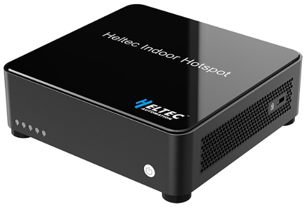

import styles from '@site/src/css/styles.module.css';

  

Heltec’s HT-M2802 is a high-performance LoRaWAN hotspot designed to provide wide-area wireless coverage for IoT networks. With its long-range LoRa technology, it can connect thousands of IoT devices over distances far greater than Wi-Fi. The HT-M2802 features a sleek, modern design for easy placement and comes ready to use right out of the box.

{

  <a href="https://heltec.org/project/ht-m2802/" className={styles.btnLink1}>
    Product Page
  </a>

}

## Features

- Processor: Quad-core Cortex-A55, 1.8GHz
- Memory & Storage: 2GB DDR4 RAM, 32GB eMMC 5.1
- LoRa Baseband: SX1303 + SX1250 chipset
- Connectivity: Wi-Fi (2.4/5GHz), Bluetooth 4.0/BLE
- Ethernet: Gigabit (10/100/1000M)

## Important Guide
- [Datasheet](https://resource.heltec.cn/download/HT-2802/HT-M2802%20Indoor%20LoRa%20Gateway.pdf)
- [Usage Guide](/docs/devices/lorawan-application/lora-gateway/ht-m2802/quick_start)
- [Install TTS Through Docker](/docs/devices/lorawan-application/lora-gateway/ht-m2802/tts-docker)
- [Frequently Asked Questions](/docs/devices/lorawan-application/lora-gateway/ht-m2802/frequently_asked_questions)

