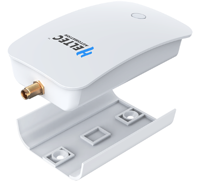

import styles from '@site/src/css/styles.module.css';

  

HT-M7603 is a high cost-effective indoor standard LoRaWAN gateway, which can be used independently or as a blind filling gateway. With simple configuration, it allows you to bridge wireless networks to IP networks and different network servers via Wi-Fi or Ethernet. HT-M7603 has a sleek, contemporary design. It is wall-mounted, can be easily placed anywhere indoor to ensure that it provides adequate signal coverage.

{

  <a href="https://heltec.org/project/ht-m7603/" className={styles.btnLink1}>
    Product Page
  </a>

}

## Product characteristicss

- Powered by MT7628 MCU with SX1303 + SX1250 chipset
- Supports LoRaWAN 1.0.2 Class A/C and custom MQTT
- Offers both Wi-Fi and Ethernet connectivity
- 5V power supply with easy Web UI configuration
- Lightweight, stylish, and wall-mounted design

## Important Guide
- [Datasheet](https://resource.heltec.cn/download/Wireless_Bridge/bridge.pdf)
- [Usage Guide](/docs/devices/lorawan-application/lora-gateway/ht-m7603/Usage)
- [MQTT Function](/docs/devices/lorawan-application/lora-gateway/ht-m7603/mqtt)
- [Frequently Asked Questions](/docs/devices/lorawan-application/lora-gateway/ht-m7603/frequently_asked_questions)