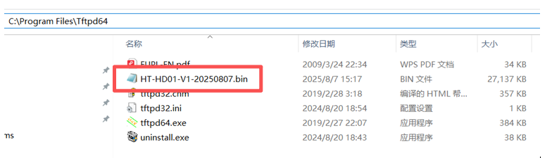
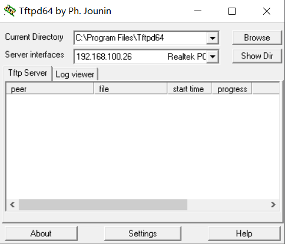
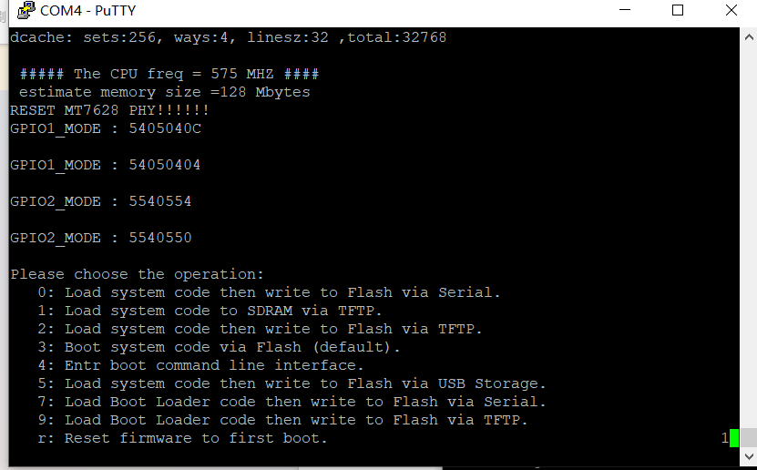
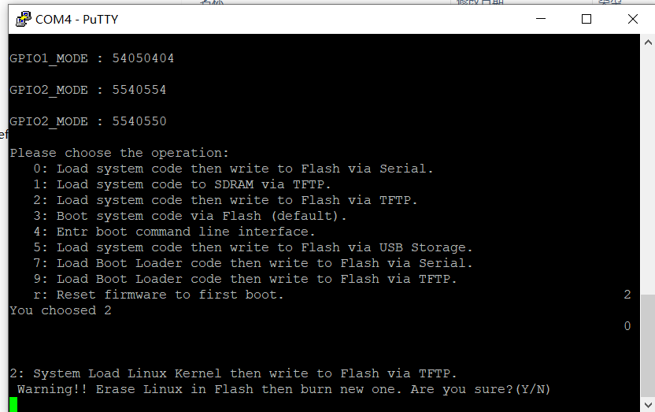
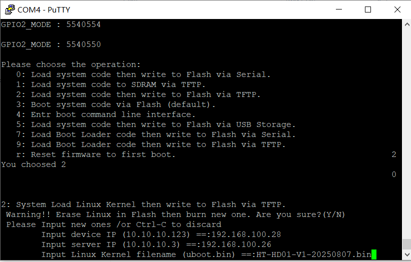
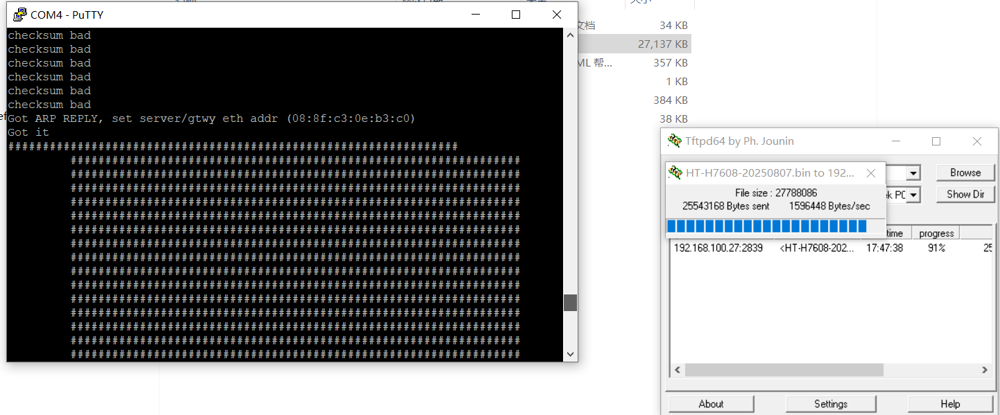
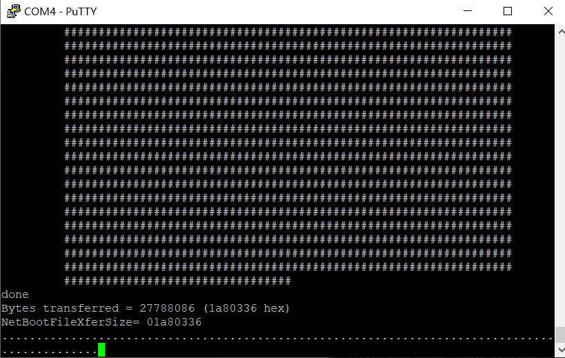

If the firmware cannot be downloaded via the OTA configuration page, follow the steps below to manually obtain and install it.

## Tool preparation

- Computer
- Type-C power cable
- Ethernet cable
- USB-to-UART module
- 2.54 mm Dupont wires
- [Firmware package](https://resource.heltec.cn/download/HT-HD01/firmware)
- Serial debugging tool (e.g. [PuTTY](https://resource.heltec.cn/download/tools/putty.zip))
- [Tftpd64](https://resource.heltec.cn/download/tools/Tftpd64-4.64-setup.zip)

## Operation steps
1. Download the corresponding firmware and record the file location

2. Set the computer IP to a fixed IP

3. Open Tftpd64. Set “Current Directory” to the folder containing the firmware, and select the PC’s IP address under “Server interfaces.

4. Connect the USB-UART module to the device (Note: the TX pin of the USB-UART module must be connected to the device’s RX pin, the RX pin to the device’s TX pin, and the GND pin to the device’s GND). Then, open the corresponding COM port using a serial debugging tool.

5. Power on the device. During startup, it will output the following log. Before the countdown finishes, select option 2 by pressing the number key “2” on the keyboard. If the message is missed, you can reset the device by pressing the RST button.

6. After selecting option 2, the following prompt will appear. Enter “Y” using the keyboard.

7. As shown in the figure below, enter the following items in sequence: the device IP (the device’s own IP; it can be any value as long as it is in the same subnet as the server IP, i.e., the PC’s IP), the server IP (the static IP configured on the PC), and the Linux Kernel filename (the firmware file to be flashed). Press Enter after each input. In other words: enter the device IP and press Enter → enter the server IP and press Enter → enter the Linux Kernel filename and press Enter.

8. After completing the input, if all configurations are correct and the procedures have been followed properly, the following screen will appear, indicating that the PC is uploading the firmware to the device.

9. After the firmware upload is completed, the following interface will appear, indicating that the firmware is being written to the device. When the serial debugging tool displays normal log output and no longer prints “……………..”, the flashing process is complete. At this point, the Ethernet cable and USB-UART module can be disconnected.
