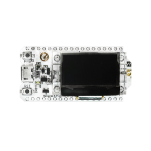
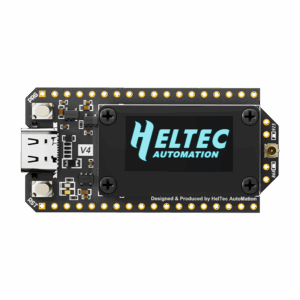
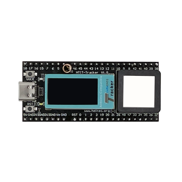
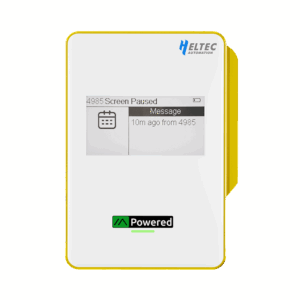
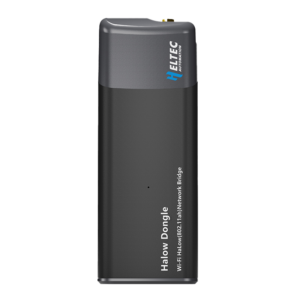
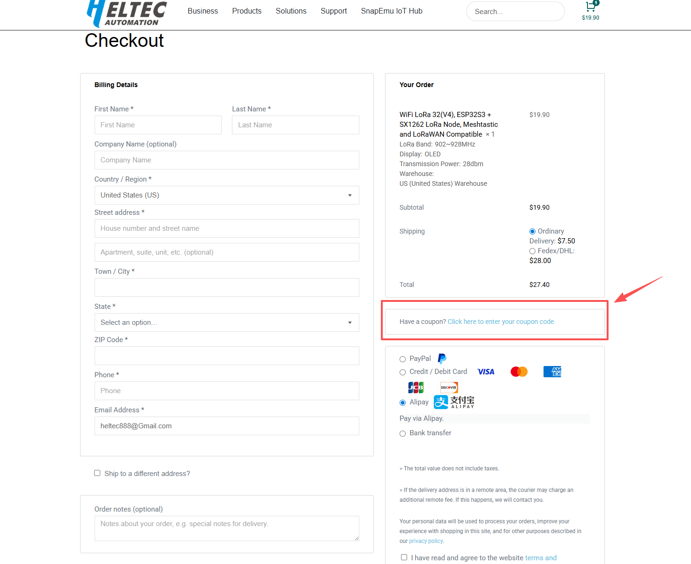

This Thanksgiving, we want to express our heartfelt gratitude to all our amazing customers and community members.  
May your holiday be filled with warmth, laughter, and cherished moments with friends and family.  
Thank you for being part of the Heltec family — your support inspires us to innovate and create every day!

<!-- truncate -->

## 🍂 Special Thanksgiving Offer: **15% OFF** 🍂

To celebrate this season of gratitude, we’re offering **15% off** on select Heltec products.  
Consider this our little gift to help you make your projects even more exciting!

## Products Included in This Offer:

[**Mesh Node T114**](https://heltec.org/project/mesh-node-t114/) — Mesh Node T114 Rev2.0 is a low-power nRF52840 + SX1262 development board supporting LoRa, Bluetooth 5.0, multiple power options, optional display/GPS, and optimized six-layer design for long-distance communication and open-source projects like Meshtastic.

[**LoRa32 V3**](https://heltec.org/project/wifi-lora-32-v3/) — WiFi LoRa 32 V3 is Heltec’s classic IoT development board, retaining Wi-Fi, BLE, LoRa, and OLED functions, ideal for smart cities, farms, homes, industrial control, security, and IoT projects.

[**LoRa32 V4**](https://heltec.org/project/wifi-lora-32-v4/)— The classic WiFi LoRa 32 development board has been upgraded to the V4 version with comprehensive improvements in craftsmanship and performance.

[**Wireless Tracker**](https://heltec.org/project/wireless-tracker/) — Wireless Tracker is an ESP32-S3FN8 development kit with SX1262 and UC6580, offering multi-system GNSS tracking and wireless data upload via Wi-Fi, Bluetooth, and LoRa.

[**MeshPocket**](https://heltec.org/project/meshpocket/) — MeshPocket is a Qi2 magnetic power bank with Bluetooth, LoRa, and e-ink display, ideal for Meshtastic projects, outdoor exploration, and emergency communication.

[**HaLow WiFi Dongle**](https://heltec.org/project/ht-hd01/) — HT-HD01 is a long-range Wi-Fi HaLow communicator operating on 902–928 MHz with up to 27 dBm transmit power and up to 32.5 Mbps throughput.

## ⚠️ Friendly Reminder  
This discount **only applies to the products listed above**.  
All other Heltec products are **not included** in this promotion.

## Discount Details:

- **Discount:** 15% off  
- **Minimum purchase:** None  
- **Valid Dates:** November 20 – November 30  

## How to Use Your Discount Code:

- **Code:** `xcybsmtj` (enter in lowercase)  
- Enter the code at checkout to enjoy the discount.

From all of us at Heltec, we wish you a Thanksgiving filled with happiness and successful projects!  